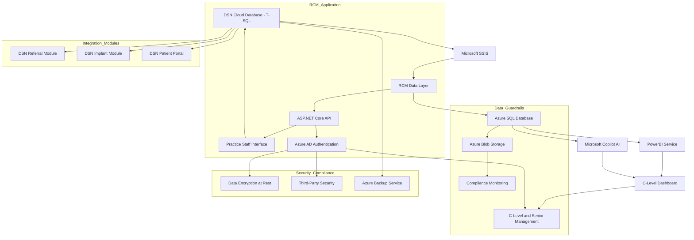

# DSN RCM Tool Case Study & Project README (Modernized)

## Overview

This case study and project README detail the architecture and implementation of a modern **Revenue Cycle Management (RCM)** solution for **Digital Services Network (DSN)**. Designed for seamless integration with the **DSN Cloud** and **Dental-Exec** platforms, the tool improves financial visibility, claim accuracy, and operational efficiency across dental practices of all sizes.

The RCM system is built with compliance and scalability in mind—supporting both a **Microsoft-based stack** leveraging SSIS and PowerBI, and a **Sage Intacct AWS-based architecture** with deep financial intelligence tools.

---

## 🏥 Business Challenge

DSN needed a comprehensive RCM solution that:

* Processes claims automatically to reduce human error.
* Integrates with T-SQL-based systems and existing modules (e.g., referral tracking, implant management).
* Restricts management access to financial data for compliance and integrity.
* Ensures full HIPAA compliance.

---

## 🎯 Objectives

* **Automate** claims workflows
* **Enable** real-time analytics and insights
* **Integrate** DSN Cloud and Dental-Exec
* **Secure** patient data under HIPAA and RBAC policies

---

## 🧱 Solution Architecture

### Microsoft-Based Stack

* **ETL Pipeline**: DSN Cloud (T-SQL) → SSIS → Azure SQL DB
* **Visualization**: PowerBI + Microsoft Copilot AI
* **Interface**: ASP.NET Core APIs + Azure AD Auth
* **Storage & Guardrails**: Azure Blob with AES-256, Immutable Logs, RBAC

### Sage Intacct (AWS-Based)

* **ETL Pipeline**: REST APIs → AWS DB (Sage Intacct Core)
* **Visualization**: Sage SaaS Intelligence + Sage Copilot
* **Storage & Compliance**: AWS HIPAA infrastructure, Built-in audit controls

---

## 📈 Workflow Diagrams

### Original Workflow (Mermaid)



### Sage Intacct Workflow (Mermaid-Compatible)

```mermaid
graph LR
    A[AWS Database (Data Storage)] --> B[Sage Intacct Core (Claims Processing)]
    B --> C[Dental-Exec Integration]
    B --> D[SaaS Intelligence (Analytics)]
    D --> E[Sage Copilot (AI Insights)]
    E --> F[Billing Output (Reports)]
    C --> F

    classDef db fill:#A3C6FF
    classDef logic fill:#B8D4FF
    classDef ai fill:#7AA5FF
    classDef vis fill:#8BB8FF

    class A,C db
    class B,F logic
    class D vis
    class E ai
```

---

## 🧰 Tech Stack Comparison

| Feature         | Microsoft Stack                    | Sage Intacct AWS Stack               |
| --------------- | ---------------------------------- | ------------------------------------ |
| Framework       | ASP.NET Core                       | HTML/JS/PHP + Sage Intacct Framework |
| Database        | Azure SQL                          | AWS-hosted proprietary DB            |
| Analytics       | PowerBI + Copilot                  | SaaS Intelligence + Sage Copilot     |
| Authentication  | Azure AD                           | Role-Based Access Control            |
| ETL/Integration | SSIS, Azure Data Factory           | REST APIs, Sage Marketplace          |
| Security        | AES-256, Immutable Logs, 3rd Party | AES-256, AWS HIPAA Infrastructure    |

---

## 💵 Pricing Comparison

| Solution         | Platform      | Pricing                         | Best For                              |
| ---------------- | ------------- | ------------------------------- | ------------------------------------- |
| DSN RCM (Legacy) | Azure Cloud   | \$15k–\$60k dev + \$300–1.2k/mo | Practices with DSN Legacy Stack       |
| Sage Intacct     | AWS Cloud     | \~\$400/mo + add-ons            | Practices needing RCM + Accounting    |
| Waystar          | Cloud         | \$500–1,000/mo/provider         | AI-Powered Claims for Hospitals       |
| DrChrono         | Cloud         | \$299/mo/provider               | Mobile-first, small practices         |
| Epic             | Cloud/On-prem | \$1,000+/mo/provider            | Large health systems (Epic Ecosystem) |

---

## 🔄 ETL Processes

### Microsoft Stack

* **Extract**: T-SQL via SSIS
* **Transform**: Normalize billing codes
* **Load**: Azure SQL → PowerBI → Copilot

### Sage Intacct

* **Extract**: REST API connectors
* **Transform**: Within Sage financial engine
* **Load**: SaaS Dashboards + Sage Copilot

---

## ✅ Key Features

* **Automation**: 40% less manual entry
* **Analytics**: Real-time, AI-driven
* **Compliance**: HIPAA + Financial Audit Trails
* **Scalability**: For solo practices to DSO networks
* **Security**: Role-based access, immutable logs

---

## 📊 Results

* **25% fewer claim denials**
* **30% faster revenue cycle times**
* **Real-time visibility for executives**
* **Secure, compliant, and scalable deployment**

---

## 🚀 Future Enhancements

* Predictive Denial Management via AI
* Expand integrations (e.g., Epic, athenahealth)
* Optimize SSIS for multi-location support
* Extend mobile UX via Sage Platform Services

---

### Presented to: **Mahmoud (Moudy) Taleb**

**Contact**: [support@dsn.com](mailto:support@dsn.com) | +1 (800) 366-1197
**Date**: June 11, 2025, 08:54 PM CDT

---

## 🏁 Credits

This case study was developed by the DSN project team in collaboration with analytical support from **Grok (xAI)** and presented to **Moudy Taleb, Software Architect at DSN**.


