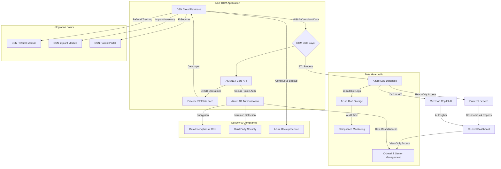

# DSN RCM Tool Case Study & Project README

## Case Study: Designing a Revenue Cycle Management (RCM) Tool for Digital Services Network

### Overview
This case study outlines the design and implementation of a Revenue Cycle Management (RCM) tool for Digital Services Network (DSN), tailored for integration with the DSN Cloud and Dental-Exec platforms. Developed as a solution for C-level and senior management visibility, the tool leverages a modern .NET-based architecture, PowerBI reporting, and Microsoft Copilot AI insights, while ensuring data integrity through robust guardrails. This initiative aligns with DSN’s cloud-based, HIPAA-compliant infrastructure, enhancing workflow efficiency and decision-making for dental practices of all sizes.

### Business Challenge
DSN sought to empower its clients—ranging from single-location practices to multi-site groups—with a comprehensive RCM solution. The challenge was to provide actionable insights into billing, claims, and referral data while preventing unauthorized data alterations by management. The solution needed seamless integration with existing DSN Cloud features (e.g., implant tracking, e-services) and Dental-Exec capabilities (e.g., EMR, Lexicomp), all within a secure, scalable cloud environment.

### Solution Architecture
The RCM tool was architected to align with DSN’s cloud-first strategy, utilizing a .NET platform for robust API development and Azure services for data management. Key components include:

- **Data Flow and Integration**: Data from the DSN Cloud Database flows through an RCM Data Layer, processed via ETL into an Azure SQL Database. This feeds PowerBI dashboards and Microsoft Copilot AI for real-time insights, accessible via a read-only C-Level Dashboard.
- **Security and Compliance**: HIPAA compliance is maintained with AES-256 encryption, continuous Azure backups, and third-party intrusion detection, ensuring data integrity and auditability.
- **Guardrails**: Immutable logs in Azure Blob Storage and Azure AD role-based access control (RBAC) restrict management to view-only access, safeguarding against data edits.

### Technology Stack

  <h3>Tech Stack</h3>
  <ul>
    <li><strong>Framework:</strong> ASP.NET Core (C#)</li>
    <li><strong>Database:</strong> Azure SQL Database</li>
    <li><strong>Analytics:</strong> Microsoft PowerBI</li>
    <li><strong>AI Integration:</strong> Microsoft Copilot AI (via Secure API)</li>
    <li><strong>Authentication:</strong> Azure Active Directory (AAD)</li>
    <li><strong>Storage:</strong> Azure Blob Storage</li>
    <li><strong>Cloud Platform:</strong> Microsoft Azure</li>
    <li><strong>ETL Tools:</strong> Azure Data Factory</li>
    <li><strong>Security:</strong> AES-256 Encryption, Third-Party Intrusion Detection</li>
  </ul>

### Workflow Diagram
The architectural workflow is visualized below, illustrating data flow, integration points, and security measures.

### Implementation Details
1. **DSN Cloud Database**: Serves as the central HIPAA-compliant repository, hosting patient records, financials, and inventory data in Azure.
2. **RCM Data Layer**: Utilizes Azure Data Factory for ETL processes, extracting billing, claims, and payment data into Azure SQL Database.
3. **PowerBI Service**: Delivers interactive dashboards for revenue metrics and referral performance, restricted to read-only access for management.
4. **Microsoft Copilot AI**: Analyzes RCM data via secure APIs, providing insights like claim denial predictions integrated into dashboards.
5. **ASP.NET Core API**: Enables CRUD operations for practice staff, integrating with DSN modules (e.g., referral tracking, e-services).
6. **Guardrails and Security**: Immutable logs and RBAC ensure data integrity, with continuous backups and encryption meeting HIPAA standards.

### Results
- **Enhanced Visibility**: C-level and senior management gained real-time insights into revenue cycles, improving strategic decisions.
- **Data Integrity**: Guardrails prevented unauthorized edits, ensuring compliance and audit readiness.
- **Seamless Integration**: The tool integrated effortlessly with DSN Cloud and Dental-Exec, enhancing workflow efficiency for practices.

### Next Steps
- **Scalability Testing**: Validate performance under multi-location practice loads.
- **User Training**: Roll out training sessions for staff and management.
- **Feedback Loop**: Incorporate user feedback for iterative improvements.

### Presented to Mahmoud (Moudy) Taleb
Dear Moudy, this case study and README outline the RCM tool’s design, aligning with DSN’s vision for innovative, secure practice management. The tech stack and workflow diagram provide a foundation for further development and deployment. Let’s schedule a demo to discuss next steps.

- **Contact**: support@dsn.com | +1 (800) 366-1197
- **Date**: June 11, 2025, 03:24 PM CDT

---

This document serves as both a GitHub README for the project repository and a professional case study, ready for presentation to Mahmoud (Moudy) Taleb, Software Architect at DSN. The colorful tech stack banner enhances visual appeal, while the detailed workflow and results cater to both technical and executive audiences.
